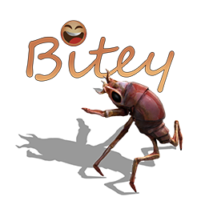

**Bitey** is Factorio mod that introduces a pet biter companion to the game. Bitey will follow you, assist in combat, react to the world, grow over time, and express itself through emotes.

---

## Installation

1. [Download](https://github.com/PwProjects/Bitey/releases/latest/download/biter-pet_0.26.2902.zip) the latest release from the **Releases** page.
2. Place the .zip file into your Factorio mods directory:

   **Windows:**  
   `%APPDATA%\Factorio\mods`

   **Linux:**  
   `~/.factorio/mods`

   **macOS:**  
   `~/Library/Application Support/factorio/mods`

3. Launch Factorio and enable the mod in the Mods menu.

## Compatibility

- Compatible with **Factorio 2.0+**.
- Works on my machine.
- It might work in multi-player? (Currently untested).
- Should be compatible with most mods (I hope).

## License

This mod is released under the **MIT License**.  
You are free to modify, distribute, and include it in modpacks with attribution.
